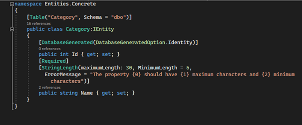

# LCBootcamp_Week2
# LCBootCamp 2. Hafta Ödevim

Bir internet sitesindeki ürün ve kategoriyi örnek alarak bir web api oluşturdum.

## Paketler 
    dotnet add package Microsoft.EntityFrameworkCore -v 5.0.10
    dotnet add package AutoMapper -v 11.0.0
    dotnet add package FluentValidation -v 10.0.4
    dotnet add package FluentValidation.DependencyInjectionExtensions -v 9.5.4
    dotnet add package Microsoft.EntityFrameworkCore.Design -v 5.0.10
    dotnet add package Microsoft.EntityFrameworkCore.Tools -v 5.0.10
    dotnet add package Microsoft.EntityFrameworkCore.SqlServer -v 5.0.10
    
    
    
# Endpoints
|HTTP|URL|METOT|
|---|---|---|
|GET| https://localhost:44339/api/Categories |GetCategories|
|GET| https://localhost:44339/api/Categories/{id} |GetById|
|PUT| https://localhost:44339/api/Categories?id={id} |UpdateCategory|
|POST| https://localhost:44339/api/Categories |AddCategory|
|DELETE| https://localhost:44339/api/Categories?id={id} |DeleteCategory|

    
# Endpoints
|HTTP|URL|METOT|
|---|---|---|
|GET| https://localhost:44339/api/Products |GetProducts|
|GET| https://localhost:44339/api/Products/{id} |GetById|
|PUT| https://localhost:44339/api/Products?id={id} |UpdateProduct|
|POST| https://localhost:44339/api/Products |AddProduct|
|DELETE| https://localhost:44339/api/Products?id={id} |DeleteProduct|

# API 

## GetCategories

## GetById

## UpdateCategory

 
## AddCategory

## DeleteCategory

## GetProducts

## GetById

## UpdateProduct

 
## AddProduct

## DeleteProduct

## Entities
## Product

## Category

